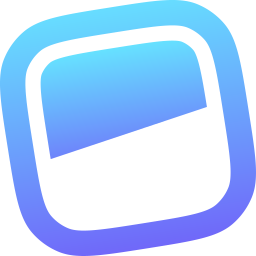

### Hi there, I'm H 👋

- ⚡ I am a Full Stack Developer with 4 years of experience
- 🔭 I am based in Oregon, USA
- 🌱 This is my off-work profile for hobby projects (mostly private!)
- 🔍 Check out my [website](https://hyun-wt.com) for more works

### Primary Tech Stacks

  
  &nbsp;
  
  &nbsp;
  
  &nbsp;
  <picture>
    <source media="(prefers-color-scheme: dark)" srcset="./assets/software/aws_dark.svg">
    <source media="(prefers-color-scheme: light)" srcset="./assets/software/aws_light.svg">
    
  </picture>

  
  &nbsp;
  
  &nbsp;
  
  &nbsp;
  
  &nbsp;
  <picture>
    <source media="(prefers-color-scheme: dark)" srcset="./assets/framework/tailwindcss-wordmark-dark.svg">
    <source media="(prefers-color-scheme: light)" srcset="./assets/framework/tailwindcss-wordmark.svg">
    
  </picture>

### I Also Love Using

##### Languages

  
  &nbsp;
  
  &nbsp;
  
  &nbsp;
  
  &nbsp;
  
  &nbsp;
  
  &nbsp;
  <picture>
    <source media="(prefers-color-scheme: dark)" srcset="./assets/language/rust_dark.svg">
    <source media="(prefers-color-scheme: light)" srcset="./assets/language/rust.svg">
    
  </picture>

##### Frameworks & Libraries

  <picture>
    <source media="(prefers-color-scheme: dark)" srcset="./assets/library/react_wordmark_dark.svg">
    <source media="(prefers-color-scheme: light)" srcset="./assets/framework/react_wordmark_light.svg">
    
  </picture>
  &nbsp;
  <picture>
    <source media="(prefers-color-scheme: dark)" srcset="./assets/framework/nextjs_logo_dark.svg">
    <source media="(prefers-color-scheme: light)" srcset="./assets/framework/nextjs_logo_light.svg">
    
  </picture>
  &nbsp;
  
  &nbsp;
  

  <picture>
    <source media="(prefers-color-scheme: dark)" srcset="./assets/framework/flask-wordmark-dark.svg">
    <source media="(prefers-color-scheme: light)" srcset="./assets/framework/flask-wordmark-light.svg">
    
  </picture>
  &nbsp;
  
  &nbsp;
  <picture>
    <source media="(prefers-color-scheme: dark)" srcset="./assets/framework/expressjs_dark.svg">
    <source media="(prefers-color-scheme: light)" srcset="./assets/framework/expressjs.svg">
    
  </picture>
  &nbsp;
  
  &nbsp;
  

  
  &nbsp;
  
  &nbsp;
  
  &nbsp;
  
  &nbsp;
  <picture>
    <source media="(prefers-color-scheme: dark)" srcset="./assets/library/threejs-dark.svg">
    <source media="(prefers-color-scheme: light)" srcset="./assets/library/threejs-light.svg">
    
  </picture>
  &nbsp;
  

  <picture>
    <source media="(prefers-color-scheme: dark)" srcset="./assets/library/socketio-wordmark-dark.svg">
    <source media="(prefers-color-scheme: light)" srcset="./assets/library/socketio-wordmark-light.svg">
    
  </picture>
  &nbsp;
  
  &nbsp;
  

##### Databases & Cloud Platforms

  <picture>
    <source media="(prefers-color-scheme: dark)" srcset="./assets/database/mysql-wordmark-dark.svg">
    <source media="(prefers-color-scheme: light)" srcset="./assets/database/mysql-wordmark-light.svg">
    
  </picture>
  &nbsp;
  <picture>
    <source media="(prefers-color-scheme: dark)" srcset="./assets/database/postgresql-wordmark-dark.svg">
    <source media="(prefers-color-scheme: light)" srcset="./assets/database/postgresql-wordmark-light.svg">
    
  </picture>
  &nbsp;
  
  &nbsp;
  
  &nbsp;
  <picture>
    <source media="(prefers-color-scheme: dark)" srcset="./assets/database/supabase_wordmark_dark.svg">
    <source media="(prefers-color-scheme: light)" srcset="./assets/database/supabase_wordmark_light.svg">
    
  </picture>
  &nbsp;
  
  &nbsp;
  
  &nbsp;
  <picture>
    <source media="(prefers-color-scheme: dark)" srcset="./assets/hosting/vercel_wordmark_dark.svg">
    <source media="(prefers-color-scheme: light)" srcset="./assets/hosting/vercel_wordmark.svg">
    
  </picture>

##### CMS & Authentication

  
  &nbsp;
  <picture>
    <source media="(prefers-color-scheme: dark)" srcset="./assets/cms/sanity-wordmark-dark.svg">
    <source media="(prefers-color-scheme: light)" srcset="./assets/cms/sanity-wordmark-light.svg">
    
  </picture>
  &nbsp;
  <picture>
    <source media="(prefers-color-scheme: dark)" srcset="./assets/cms/shopify-wordmark-dark.svg">
    <source media="(prefers-color-scheme: light)" srcset="./assets/cms/shopify-wordmark-light.svg">
    
  </picture>
  &nbsp;
  <picture>
    <source media="(prefers-color-scheme: dark)" srcset="./assets/auth/clerk-wordmark-dark.svg">
    <source media="(prefers-color-scheme: light)" srcset="./assets/auth/clerk-wordmark-light.svg">
    
  </picture>
  &nbsp;
  
  &nbsp;
  <picture>
    <source media="(prefers-color-scheme: dark)" srcset="./assets/auth/better-auth_wordmark_dark.svg">
    <source media="(prefers-color-scheme: light)" srcset="./assets/auth/better-auth_wordmark_light.svg">
    
  </picture>

##### Software & Tools

  
  &nbsp;
  
  &nbsp;
  
  &nbsp;
  

##### AI Integration & Tools & Automation

  <picture>
    <source media="(prefers-color-scheme: dark)" srcset="./assets/ai/openai_wordmark_dark.svg">
    <source media="(prefers-color-scheme: light)" srcset="./assets/ai/openai_wordmark_light.svg">
    
  </picture>
  &nbsp;
  <picture>
    <source media="(prefers-color-scheme: dark)" srcset="./assets/ai/claude-ai-wordmark-icon_dark.svg">
    <source media="(prefers-color-scheme: light)" srcset="./assets/ai/claude-ai-wordmark-icon_light.svg">
    
  </picture>
  &nbsp;
  
  &nbsp;
  <picture>
    <source media="(prefers-color-scheme: dark)" srcset="./assets/ai/n8n-wordmark-dark.svg">
    <source media="(prefers-color-scheme: light)" srcset="./assets/ai/n8n-wordmark-light.svg">
    
  </picture>

##### Design Tools

  
  &nbsp;
  
  &nbsp;
  

